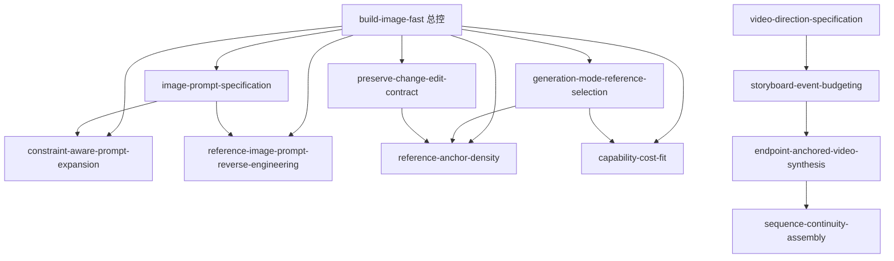

# AI Image & Video Skill Index

本仓库包含 **11 个原子 Skill＋1 个总控工作流 Skill**。

## 总控入口

- [`build-image-fast`](./build-image-fast/SKILL.md)：从抽象 Idea 到已确认的 AI Image Build Pack 和通过 QA 的最终静态图片。适合主视觉、海报、漫画、信息图和产品图等完整项目。

八阶段：需求与边界 → 创意方向 → 故事/信息结构 → 视觉规格与锚点 → 生成路线与提示词 → 候选生成 → QA/返修 → 正式交付。

## 原子 Skill

### 图片提示词与静态控制

- [`image-prompt-specification`](./image-prompt-specification/SKILL.md)
- [`reference-image-prompt-reverse-engineering`](./reference-image-prompt-reverse-engineering/SKILL.md)
- [`constraint-aware-prompt-expansion`](./constraint-aware-prompt-expansion/SKILL.md)

### 输入、编辑与一致性

- [`generation-mode-reference-selection`](./generation-mode-reference-selection/SKILL.md)
- [`capability-cost-fit`](./capability-cost-fit/SKILL.md)
- [`preserve-change-edit-contract`](./preserve-change-edit-contract/SKILL.md)
- [`reference-anchor-density`](./reference-anchor-density/SKILL.md)

### 视频叙事、生成与装配

- [`video-direction-specification`](./video-direction-specification/SKILL.md)
- [`storyboard-event-budgeting`](./storyboard-event-budgeting/SKILL.md)
- [`endpoint-anchored-video-synthesis`](./endpoint-anchored-video-synthesis/SKILL.md)
- [`sequence-continuity-assembly`](./sequence-continuity-assembly/SKILL.md)

## 组合关系

## 路由原则

- 需要完整 0→1 静态图片项目：`build-image-fast`
- 只写或优化图片提示词：`image-prompt-specification`
- 只反推参考图：`reference-image-prompt-reverse-engineering`
- 只比较模型成本/能力：`capability-cost-fit`
- 只做局部编辑合同：`preserve-change-edit-contract`
- 完整 5–30 秒视频项目：`build-ai-video-fast`（如已安装）

## 验证入口

- [verified.md](./verified.md)：仓库级验证范围
- [`build-image-fast/test-prompts.json`](./build-image-fast/test-prompts.json)：总控合同用例
- [`build-image-fast/test-results.md`](./build-image-fast/test-results.md)：静态合同、情境演练与真实生成分栏记录
- 各原子 Skill 的 `test-prompts.json` 与 `test-results.md`：原有 66 条测试
