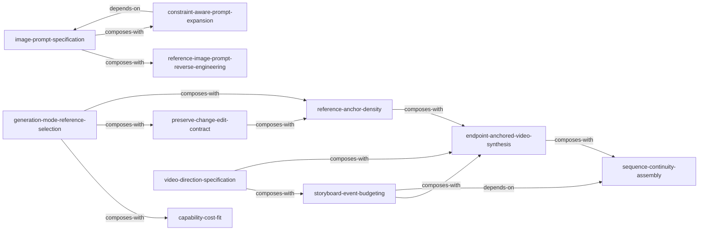

# AI Image & Video Skill Index

> 本仓库由 [cangjie-skill](https://github.com/kangarooking/cangjie-skill) 蒸馏，汇集 11 个可组合的 AI 影像创作 skill。构建日期：2026-07-27。

## 一句话主旨

AI 影像生成不是“写一条更长 prompt”的竞赛；先用正确的输入承载难控制变量，再用锚点、分镜、端点和剪辑约束把结果变成可交付的序列。

## Skill 列表

### 图片提示词与静态控制

- [`image-prompt-specification`](./image-prompt-specification/SKILL.md) — 用四维意图查漏、并按任务裁剪字段。
- [`reference-image-prompt-reverse-engineering`](./reference-image-prompt-reverse-engineering/SKILL.md) — 从可见证据反推提示词并保留不确定性。
- [`constraint-aware-prompt-expansion`](./constraint-aware-prompt-expansion/SKILL.md) — 在控制与探索之间选择 AI 扩写模式。

### 输入、编辑与一致性

- [`generation-mode-reference-selection`](./generation-mode-reference-selection/SKILL.md) — 为外观、动作、镜头、节拍分配正确的输入模态。
- [`capability-cost-fit`](./capability-cost-fit/SKILL.md) — 按风险而非“最高规格”选择模型能力档位。
- [`preserve-change-edit-contract`](./preserve-change-edit-contract/SKILL.md) — 明确局部编辑的改变项与保留项。
- [`reference-anchor-density`](./reference-anchor-density/SKILL.md) — 为身份、产品和跨镜头一致性配置足够锚点。

### 视频叙事、生成与装配

- [`video-direction-specification`](./video-direction-specification/SKILL.md) — 将情绪、故事和镜头感写成可观察的动态规格。
- [`storyboard-event-budgeting`](./storyboard-event-budgeting/SKILL.md) — 用时长和事件预算决定分镜与生成颗粒度。
- [`endpoint-anchored-video-synthesis`](./endpoint-anchored-video-synthesis/SKILL.md) — 用首尾帧或关键帧锁定必须命中的状态。
- [`sequence-continuity-assembly`](./sequence-continuity-assembly/SKILL.md) — 用转场、动作连接和节拍修复生成片段之间的断裂。

## 关系图

图例：`-->` 为依赖或建议先后；`composes-with` 表示适合在同一工作流组合使用。

## 推荐学习顺序

1. `image-prompt-specification`：先学会表达静态画面意图。
2. `generation-mode-reference-selection`：学会为不同变量选择正确素材和输入模式。
3. `capability-cost-fit`：以风险与预算约束工作流。
4. `preserve-change-edit-contract` 与 `reference-anchor-density`：让编辑与一致性可验收。
5. `video-direction-specification`：将故事意图转成动态导演规格。
6. `storyboard-event-budgeting`：将想法拆成合适数量和时长的镜头。
7. `endpoint-anchored-video-synthesis`：在需要确定收尾、变形完成态或循环时锁定端点。
8. `sequence-continuity-assembly`：最后解决片段之间的连续性与节奏。

## 审计轨迹

- [COURSE_OVERVIEW.md](./COURSE_OVERVIEW.md)：课程级方法论与适用边界。
- [verified.md](./verified.md)：三重验证记录。
- 各 skill 目录中的 `test-prompts.json`：触发、反例与边界测试。
- 各 skill 目录中的 `test-results.md`：独立盲测的判定记录。
